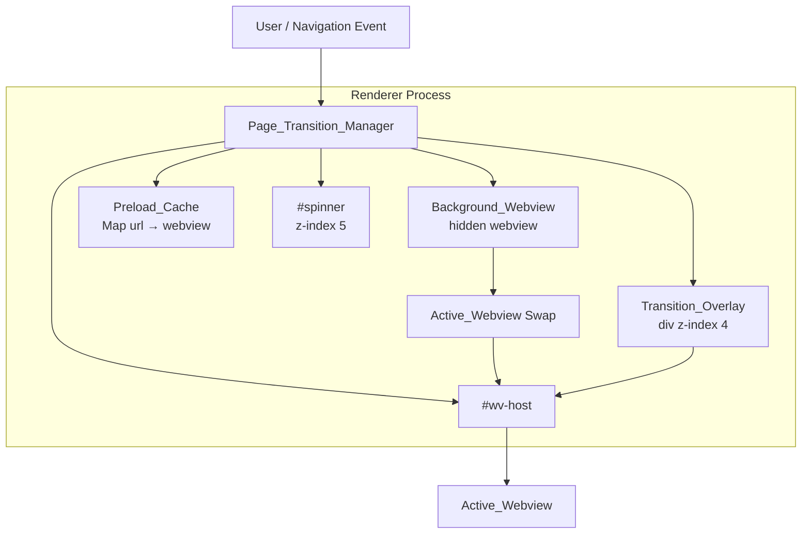

# Design Document — Smooth Page Transitions

## Overview

KX Browser currently exposes the dark `#0e0e0e` background for several frames during every
navigation because the active `<webview>` is updated in-place: its `src` changes, the old page
unloads, and the new page repaints from scratch. The gap between unload and first paint shows a
black flash that is especially jarring when following links from Google.

The **Smooth Page Transitions** feature introduces a `Page_Transition_Manager` module that sits
entirely in the renderer layer (`renderer.js`). It coordinates four complementary mechanisms:

1. **Transition Overlay** — a `<div>` rendered above `#wv-host` that holds the snapshot or a
   dark fallback, preventing any background from being exposed between navigations.
2. **Snapshot-based paint-hold** — captures `capturePage()` at the moment navigation begins,
   encodes it as JPEG/80%, and uses it as the overlay's `background-image` so the previous page
   stays visible while the next loads.
3. **Background webview loading** — the new page is loaded in a hidden `<webview>` rather than
   replacing the active one; the swap happens only after `dom-ready` fires.
4. **Preload cache** — up to 5 per-tab cached webviews for bookmark and recently-visited URLs,
   enabling instant revisits.

No changes to `main.js`, `preload.js`, or the IPC surface are required. The feature is a
renderer-only module that wraps and supersedes the current `goInTab`, `switchTab`, and
`attachWvEvents` patterns.

---

## Architecture



### Data-flow for a normal navigation

```
1.  Navigation_Event triggered
2.  capturePage() on Active_Webview       → JPEG data-URL
3.  Insert Transition_Overlay (opacity:1, background-image = snapshot)
4.  Set #wv-host background: transparent
5.  Add 'show' to #spinner
6.  Create Background_Webview (display:none, correct partition)
7.  Background_Webview dom-ready fires
8.  Begin 200 ms opacity-0 CSS transition on Transition_Overlay
9.  Display Background_Webview (display:flex), hide previous Active_Webview
10. Remove #spinner 'show' class
11. transitionend fires → clear background-image, remove Transition_Overlay
12. Restore #wv-host background: #0e0e0e
```

---

## Components and Interfaces

### Page_Transition_Manager (new module in renderer.js)

The manager is a plain JavaScript IIFE/closure that owns all transition state and exposes a small
public API consumed by the existing tab/navigation code.

```javascript
/**
 * Page_Transition_Manager
 * Encapsulates all smooth-transition logic for KX Browser.
 */
const Page_Transition_Manager = (() => {

  // ── Constants ─────────────────────────────────────────────────────────
  const PAINT_HOLD_DURATION = 8_000;    // ms before overlay forcibly dismissed
  const SNAPSHOT_FREE_MS   = 10_000;   // ms after which snapshot data-URL is freed
  const STALE_CACHE_MS     = 30_000;   // ms before cached webview is considered stale
  const MAX_CACHE_PER_TAB  = 5;
  const MAX_BG_WEBVIEWS    = 2;
  const IDLE_PURGE_MS      = 30 * 60 * 1_000; // 30 minutes

  // ── Per-tab state  Map<tabId, TabState> ──────────────────────────────
  // TabState = {
  //   activeWv:      WebviewElement,
  //   bgWv:          WebviewElement | null,
  //   overlay:       HTMLDivElement | null,
  //   holdTimer:     number | null,
  //   snapFreeTimer: number | null,
  //   cache:         Map<url, CacheEntry>,
  //   loadingDone:   boolean,
  // }
  //
  // CacheEntry = { wv, lastAccess, ready }

  // ── Global bg-webview pool  Array<{tabId, wv, createdAt}> ────────────

  // ── Public API ────────────────────────────────────────────────────────
  return {
    /** Must be called once per new tab, replacing createWebviewForTab(). */
    initTab(tab, partition) {},

    /** Replaces goInTab(). Starts a smooth navigation for the given tab. */
    navigate(rawUrl, tabId) {},

    /** Replaces switchTab(). Handles tab switching with flash-free logic. */
    switchTab(fromTabId, toTabId) {},

    /** Called when a bookmark button is clicked. Preloads the URL. */
    preloadBookmark(url, tabId) {},

    /** Must be called when a tab is closed to free all resources. */
    closeTab(tabId) {},

    /** Returns the active webview element for a tab. */
    getActiveWv(tabId) {},
  };
})();
```

### Transition_Overlay element

Created fresh for each navigation; never reused across navigations.

```javascript
function createOverlay() {
  const div = document.createElement("div");
  div.style.cssText = [
    "position:absolute",
    "inset:0",
    "z-index:4",
    "opacity:1",
    "background-color:#0e0e0e",
    "background-size:cover",
    "background-position:center",
    "background-repeat:no-repeat",
    "pointer-events:none",
    "transition:opacity 200ms ease",
  ].join(";");
  return div;
}
```

### Background_Webview element

Created per navigation, parented to `#wv-host`.

```javascript
function createBgWebview(url, partition) {
  const wv = document.createElement("webview");
  wv.src = url;
  wv.partition = partition;
  wv.setAttribute("allowpopups", "");
  wv.style.cssText = [
    "position:absolute",
    "top:0", "left:0",
    "width:100%", "height:100%",
    "display:none",
    "background:transparent",
  ].join(";");
  return wv;
}
```

### Interaction with existing renderer.js

| Existing function        | Action after PTM integration                                      |
|--------------------------|-------------------------------------------------------------------|
| `createWebviewForTab(tab)` | Replaced — `PTM.initTab(tab, partition)` creates the initial webview |
| `goInTab(rawUrl, tabId)` | Replaced — delegates to `PTM.navigate(rawUrl, tabId)`            |
| `switchTab(id)`          | Augmented — calls `PTM.switchTab(fromId, toId)` before updating UI |
| `attachWvEvents(wv, tab)`| Superseded — PTM manages all webview event listeners internally  |
| `createTab(url)`         | Calls `PTM.initTab` instead of `createWebviewForTab`             |
| `closeTab(id)`           | Calls `PTM.closeTab(id)` before splicing from `tabs[]`           |
| Bookmark buttons         | `PTM.preloadBookmark(url, tabId)` on click                       |

---

## Data Models

### TabState

```typescript
interface TabState {
  tabId:         string;
  partition:     string;
  activeWv:      WebviewElement;
  bgWv:          WebviewElement | null;
  overlay:       HTMLDivElement | null;
  holdTimer:     ReturnType<typeof setTimeout> | null;  // Paint_Hold_Duration
  snapFreeTimer: ReturnType<typeof setTimeout> | null;  // 10 s snapshot free
  loadingDone:   boolean;   // has activeWv fired did-stop-loading?
  cache:         Map<string, CacheEntry>;
}
```

### CacheEntry

```typescript
interface CacheEntry {
  url:        string;
  wv:         WebviewElement;
  ready:      boolean;    // did-stop-loading has fired
  lastAccess: number;     // Date.now() at last cache insertion or access
}
```

### BackgroundWebviewRecord (global pool)

```typescript
interface BgWvRecord {
  tabId:     string;
  wv:        WebviewElement;
  createdAt: number;   // Date.now()
}
```

### NavigationContext (internal value object)

```typescript
interface NavigationContext {
  tabId:           string;
  targetUrl:       string;
  snapshotDataUrl: string | null;
  overlay:         HTMLDivElement;
  bgWv:            WebviewElement;
  startedAt:       number;
}
```

---

## Correctness Properties

### Property 1: Navigation initialization order

For any tab state and target URL, when a Navigation_Event is triggered, the Transition_Overlay
must be present in the DOM and the Background_Webview must be appended to `#wv-host` **before**
the Active_Webview's `src` attribute is modified, and the spinner's `show` class must be added
only after the overlay's `opacity` is already `1`.

**Validates: Requirements 1.1, 2.1, 3.1, 5.1**

---

### Property 2: Overlay z-index invariant

For any Transition_Overlay element created by the Page_Transition_Manager, its CSS `z-index`
must equal `4` for the entire duration it is present in the DOM.

**Validates: Requirement 1.2**

---

### Property 3: Paint-hold timeout dismissal

For any navigation where the Background_Webview does not fire `dom-ready` within 8000 ms, the
Transition_Overlay must have its `opacity` set to `0` and be removed from the DOM by the time
the 8000 ms timer fires.

**Validates: Requirements 1.4, 1.5**

---

### Property 4: Concurrent navigation cancellation

For any sequence of two or more Navigation_Events targeting the same tab in quick succession,
each new event must result in the in-flight Background_Webview being removed and the
in-progress Transition_Overlay being torn down before the fresh Background_Webview and new
Transition_Overlay are created.

**Validates: Requirements 1.6, 3.6**

---

### Property 5: Snapshot capture fallback

For any navigation where `capturePage()` rejects, times out after 500 ms, or resolves with an
empty NativeImage, the Transition_Overlay must be inserted with no `background-image` (showing
the `#0e0e0e` fallback only), and the navigation must complete normally.

**Validates: Requirement 2.2**

---

### Property 6: Snapshot JPEG quality

For any successful `capturePage()` call, the resulting NativeImage must be encoded via
`.toJPEG(80)` before being set as the overlay's `background-image`.

**Validates: Requirement 2.4**

---

### Property 7: Snapshot memory cleanup

For any Transition_Overlay that reaches `transitionend`, its `background-image` must be set
to `none` and the element removed from the DOM within 500 ms. Additionally, if the overlay
is still present after 10 seconds, the `background-image` must be set to `none` by the
10-second timer.

**Validates: Requirements 2.5, 8.3**

---

### Property 8: Background webview partition inheritance

For any tab, every Background_Webview and Preload_Cache webview created for that tab must
carry an identical `partition` attribute so session state is shared across navigations.

**Validates: Requirements 3.4, 4.2**

---

### Property 9: Webview swap correctness

For any navigation where the Background_Webview fires `dom-ready`, it must become
`display:flex` (new Active_Webview) and the previous Active_Webview must become
`display:none`. If the previous Active_Webview is not in the Preload_Cache, `.remove()`
must be called on it.

**Validates: Requirements 3.2, 3.3**

---

### Property 10: Load failure recovery

For any Background_Webview or Preload_Cache webview that fires `did-fail-load` with an
error code other than `-3`, the Transition_Overlay must be dismissed, the failed webview
promoted to Active_Webview, and the Preload_Cache entry (if any) deleted.

**Validates: Requirements 3.5, 4.6**

---

### Property 11: Preload cache size invariant

For any sequence of cache insertions, the Preload_Cache for any tab must never contain more
than 5 entries. When an insertion would exceed 5 entries, the entry with the oldest
`lastAccess` timestamp must be evicted before the new entry is inserted.

**Validates: Requirements 4.1, 4.5**

---

### Property 12: Cache hit — instant navigation

For any navigation where the target URL is in the Preload_Cache with `ready: true` and
`lastAccess` within 30 seconds, no Transition_Overlay must be inserted and the cached
webview must be promoted directly to Active_Webview.

**Validates: Requirement 4.3**

---

### Property 13: Stale cache reload

For any navigation where the target URL is in the Preload_Cache but its `lastAccess` is
more than 30 seconds old, `.reload()` must be called on the cached webview and a
Transition_Overlay displayed until the reload's `dom-ready` fires.

**Validates: Requirement 4.4**

---

### Property 14: Background webview global limit

For any sequence of navigation events across all tabs, the total count of
Background_Webview elements simultaneously present in the DOM must never exceed 2.

**Validates: Requirement 8.1**

---

### Property 15: Tab close resource cleanup

For any tab that is closed, every Background_Webview and Preload_Cache webview for that
tab must have `.remove()` called on it and all Preload_Cache map entries deleted within
one animation frame.

**Validates: Requirement 8.2**

---

### Property 16: Idle cache purge

If no keyboard event, mouse button press, mouse movement, or scroll event occurs for 30
minutes, every Preload_Cache webview across all tabs must be removed and all cache maps
cleared. Any user interaction within that window must reset the idle timer.

**Validates: Requirements 8.4, 8.5**

---

### Property 17: Background color management

Every new webview appended to `#wv-host` must have inline `background: transparent`. While
a Transition_Overlay is present, `#wv-host`'s inline `background` must be `transparent`.
Once the overlay is removed, `#wv-host`'s inline `background` must be restored to `#0e0e0e`
within one animation frame.

**Validates: Requirements 6.1, 6.2, 6.3, 6.4**

---

### Property 18: Tab switch overlay correctness

For any tab switch to a tab whose Active_Webview has not yet fired `did-stop-loading`, a
Transition_Overlay must be inserted with only the `#0e0e0e` fallback (no `capturePage()`
call). For any tab switch to an already-loaded tab, no Transition_Overlay must be inserted.

**Validates: Requirements 7.1, 7.2, 7.3, 7.4**

---

## Error Handling

### capturePage() failure

`capturePage()` is wrapped in a `Promise.race` against a 500 ms timeout sentinel. All three
outcomes — rejection, timeout, empty NativeImage — are caught and unified into a single
"no snapshot" code path. Navigation always proceeds; the overlay shows the dark fallback.

```javascript
async function captureSnapshot(wv) {
  try {
    const result = await Promise.race([
      wv.capturePage(),
      new Promise((_, rej) => setTimeout(() => rej(new Error("timeout")), 500)),
    ]);
    if (!result || result.isEmpty()) return null;
    return result.toJPEG(80).toString("base64");
  } catch {
    return null;
  }
}
```

### did-fail-load (non-abort)

Error code `-3` is Chromium's "user aborted" signal. All other codes are genuine failures.
The handler dismisses the overlay and promotes the failed webview so the browser's built-in
error page is shown.

### Background_Webview global limit exceeded

Before creating any new Background_Webview the manager checks the global `bgPool`. If it
already holds 2 entries, the oldest one (by `createdAt`) is removed from the DOM and pool
first.

### Idle purge failure

The idle timer is reset on `keydown`, `mousedown`, `mousemove`, and `wheel` on `document`.
If any handler throws, the error is caught silently; the timer fires as a safe fallback.

### Overlay stuck (transitionend never fires)

A backup `setTimeout` of 500 ms is always set after beginning any fade-out, ensuring
cleanup even if `transitionend` is suppressed by Chromium.

---

## Testing Strategy

### Test environment

The feature is a pure DOM + webview event-handling module with no IPC calls. Tests run in
**Node.js + jsdom** (via Vitest) with lightweight stubs for Electron `<webview>` — its event
emitter interface and `capturePage()` / `reload()` / `remove()` methods.

```
devDependencies to add:
  vitest               ^1.x
  @fast-check/vitest   ^0.1.x
  jsdom                ^24.x
```

### Unit tests (example-based)

- Overlay is dismissed when `dom-ready` fires (verifying the 200 ms CSS transition starts)
- Reload button click during loading tears down overlay and spinner within one frame
- Tab switch to already-loaded tab inserts no overlay
- `#spinner` z-index is 5 (CSS smoke test via `getComputedStyle`)
- `did-fail-load` with code `-3` does not dismiss overlay

### Property-based tests (fast-check)

Each property maps 1-to-1 to a numbered Correctness Property above.
Minimum 100 runs per property (`numRuns: 100`).

Tag format used in every test:
```
// Feature: smooth-page-transitions, Property N: <property text>
```

Key arbitraries:

| Arbitrary | Description |
|---|---|
| `fc.string()` | Random URL strings |
| `fc.integer({ min: 1, max: 10 })` | Number of tabs |
| `fc.array(fc.string(), { minLength: 1, maxLength: 20 })` | Navigation URL sequences |
| `tabStateArb` | Custom arbitrary producing a valid TabState with stubbed webviews |
| `fc.boolean()` | Whether capturePage resolves or rejects |
| `fc.integer({ min: -100, max: -1 }).filter(n => n !== -3)` | Non-abort error codes |

Example property tests:

```javascript
// Feature: smooth-page-transitions, Property 11: Preload cache size invariant
test.prop([fc.array(fc.webUrl(), { minLength: 1, maxLength: 20 })])(
  "cache never exceeds MAX_CACHE_PER_TAB",
  (urls) => {
    const tab = createTestTab();
    urls.forEach(url => PTM.preloadBookmark(url, tab.id));
    expect(PTM._cacheSize(tab.id)).toBeLessThanOrEqual(5);
  }
);

// Feature: smooth-page-transitions, Property 14: Background webview global limit
test.prop([fc.array(fc.tuple(fc.string(), fc.webUrl()), { minLength: 3, maxLength: 10 })])(
  "background webview count never exceeds 2",
  (navEvents) => {
    navEvents.forEach(([tabId, url]) => PTM.navigate(url, tabId));
    expect(countBgWebviews()).toBeLessThanOrEqual(2);
  }
);
```

### Integration smoke tests

Validated manually in a running Electron process:

1. Navigate between 5+ pages — verify zero black flashes visually.
2. Click bookmark while on a loaded page — verify instant revisit on second click.
3. Close tabs with in-flight navigations — verify no leaked webview elements in DevTools.
4. Leave browser idle 30+ minutes — verify cache cleared (memory drops in Task Manager).
